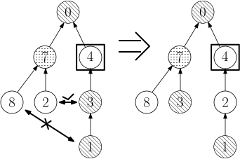
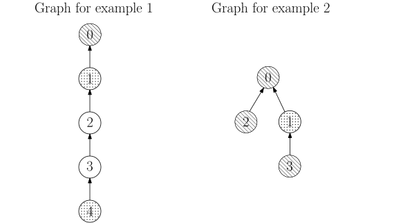
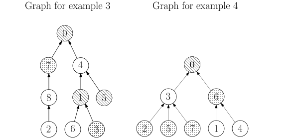

# C. Team Coding

| Problem Name | Team Coding |
| --- | --- |
| Time Limit | 4 seconds |
| Memory Limit | 1 gigabyte |
The company Eindhoven Gigantic Open-Source Institute (EGOI) is structured in a very hierarchical way. Except for the CEO Anneke, each of the other $N  - 1$ employees in the company has a unique boss that they report to, and there are no cycles in the hierarchy. You can think of the company hierarchy as a tree rooted in the vertex corresponding to Anneke.
As this is a diverse company, the employees code in $K$ different programming languages, but every employee has exactly one preferred programming language.

Anneke has a big new project for a team in her company to work on. She wants to put as many resources as possible into this project. To decide the team who will work on this, she does the following:
1. Pick a person to lead the team. This will also define the programming language the project is coded in. Every employee who is in the subtree below the team lead and prefers the same programming language will work on the problem.
1. Increase the number of employees who work on the project, by switching  employees who prefer the same programming language as the team lead into her team.

 To maximize the number of employees who work on the project, she can perform the following switching operation any number of times:

  1. She picks two employees:
    - One employee who is currently in the subtree of the team lead and does not prefer the same programming language as the team lead.
   
    - One employee who is not in this subtree at the moment and prefers the same programming language as the team lead.
    Additionally, this employee needs to be on the same level as the other chosen employee; that is, they need to have the same number of higher-ups in the report chain to Anneke. If you imagine the company hierarchy as a tree, then the two employees are on the same level of the tree.
  1. Those two employees (and *only* them &ndash; not any other employees) switch positions in the company hierarchy.
Note that employees reporting to the two affected employees stay in place and just change whom they report to.
In the example below, with employee $4$ having been chosen as the team lead, we can swap employees $3$ and $2$ but not employees $1$ and $8$.

 

Find the maximum number of employees working on the new project you can reach and the minimum number of switching operations needed to achieve this.

## Input

The first line of the input contains two integers, $N$ and $K$, the number of employees of EGOI and the number of programming languages the employees might use.

The employees of EGOI are numbered from $0$ to $N-1$, and Anneke the CEO has number $0$.
The next line contains $N$ integers $\ell\_i$ with $0\le \ell\_i<K$, the preferred programming languages of the employees.

The next $N-1$ lines contain the company structure.
The $i$th line contains an integer $b\_i$ with $0\le b\_i<N$, the direct boss of the $i$th employee. Note that $i$ goes from $1$ to $N - 1$ (inclusive), as Anneke, the CEO, does not have a boss.

## Output

Output a single line with two integers, $P$ and $S$, the maximum number of employees (including the team lead) working on the new project you can reach with any number of switches and the *minimum* number of switches needed to reach this.

## Constraints and Scoring

* $1 \le N \le 10^5$.
* $1 \le K \le N$.

Your solution will be tested on a set of test groups, each worth a number of points.
Each test group contains a set of test cases. To get the points for a test group, you need to
solve all test cases in the test group.

| Group | Score | Limits |
| --- | --- | --- |
| $1$ | $12$ | The direct boss of employee $i$ is $i-1$ for all $1\le i<N$. |
| $2$ | $19$ | $K\le 2$ |
| $3$ | $27$ | For each programming language, there are at most $10$ employees that prefer it |
| $4$ | $23$ | $N\le 2\,000$ |
| $5$ | $19$ | No further constraints |

## Examples

In the first two samples, the company structure looks as follows, where the pattern encodes the programming language (0 = “striped”, 1 = “dotted”, 2 = “plain”):

In sample 1, we can choose employee $1$ as the team lead with employee $4$ preferring the same programming language and there are no possible switches to improve this.
In sample 2, the full company has $3$ employees preferring language $0$ which is also Anneke's preferred language, so choosing Anneke as the team lead gives a team of size $3$ with no switches needed.

In sample 3, we choose employee $4$ as the team lead and then we can have employees $1$ & $8$ and $2$ & $3$ switch teams to get a total of $4$ employees preferring the same language as $4$, namely language $2$ (plain).
In sample 4, the maximum score can be obtained by choosing employee $6$ as the team lead and switching employees $4$ & $7$ and $1$ & $5$. Note that we cannot switch employees $6$ & $3$ before choosing the team lead to get a score of $4$ because we have to fix the team lead first.

